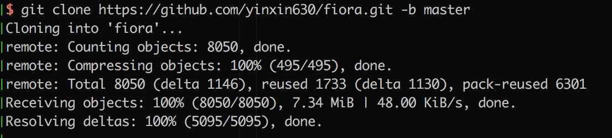
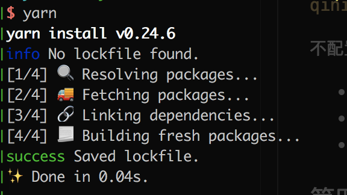
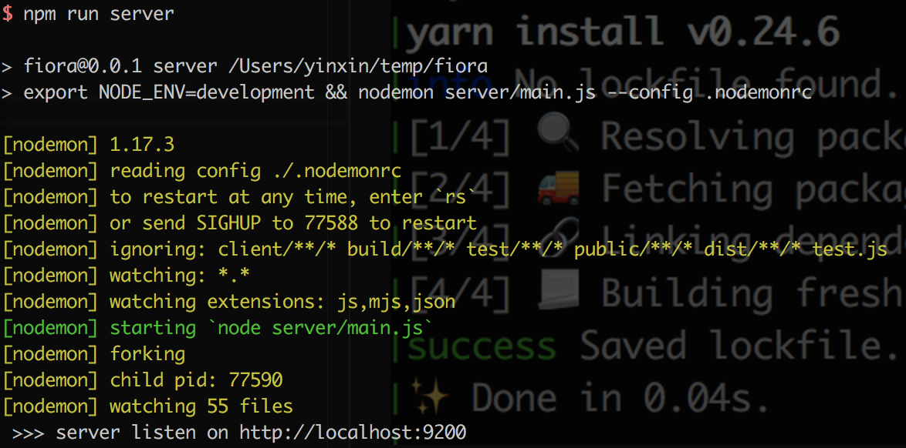
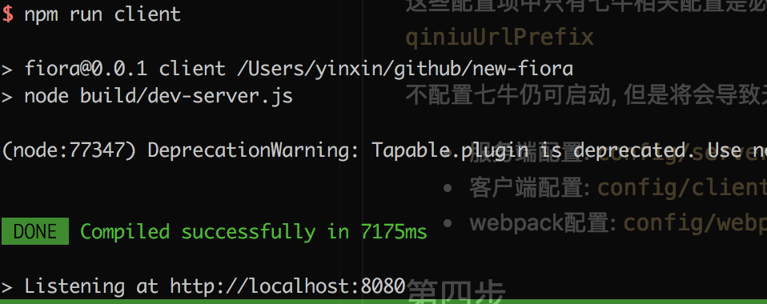

# 安装

要运行Fiora, 你需要具备Node.js(>= 8.9.0版本)环境, Mongodb数据库, 以及七牛云存储账号(图片需要存到七牛)

## 第一步

克隆项目到本地 `git clone https://github.com/yinxin630/fiora.git -b master`

## 第二步

安装依赖, 推荐使用yarn `yarn` 或者 `npm install`

## 第三步

修改配置文件:

这些配置项中只有七牛相关配置是必填的, 包括: `qiniuAccessKey`, `qiniuSecretKey`, `qiniuBucket`, `qiniuUrlPrefix`

不配置七牛也可以运行, 但是将会导致无法发送图片消息, 无法修改个人/群组头像

- 服务端配置: `config/server.js`
- 客户端配置: `config/client.js`
- webpack配置: `config/webpack.js`

## 第四步

启动服务端 `npm run server`

## 第五步

启动客户端 `npm run client`

## 第六步

浏览器将会自动打开Fiora, 你也可以手动打开地址 `http://localhost:8080`