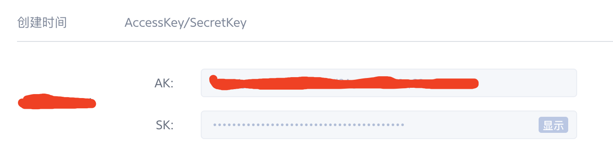
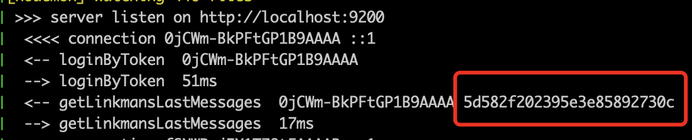

# 安装教程

## 环境准备

要运行 Fiora, 你需要 Node.js(v14 LTS版本) 开发环境和 MongoDB 数据库  
- 安装 Node.js
   - 官网 <http://nodejs.cn/download/>
   - 更推荐使用 nvm 安装 Node.js
      - 安装 nvm <https://github.com/nvm-sh/nvm#install--update-script>
      - 通过 nvm 安装 Node.js <https://github.com/nvm-sh/nvm#usage>
- 安装 MongoDB
   - 官网 <https://docs.mongodb.com/manual/installation/#install-mongodb>

推荐在 Linux 或者 MacOS 系统上运行

## 如何运行

1. 克隆项目到本地 `git clone https://github.com/yinxin630/fiora.git -b master`
2. 安装项目依赖 `yarn install`
3. 构建客户端代码 `yarn build:client && yarn move-dist`
4. 启动服务端 `yarn start`
6. 使用浏览器打开 `http://[ip地址]:[端口]`(比如 `http://127.0.0.1:9200`)

### 运行开发模式

1. 启动服务端 `yarn dev:server`
2. 启动客户端 `yarn dev:client`
3. 使用浏览器打开 `http://localhost:8080`

### docker运行
首先安装docker <https://docs.docker.com/install/>

#### 直接从 DockerHub 镜像运行
1. 拉取 mongo 镜像 `docker pull mongo`
2. 拉取 fiora 镜像 `docker pull suisuijiang/fiora`
3. 创建虚拟网络 `docker network create fiora-network`
4. 启动数据库 `docker run --name fioradb -p 27017:27017 --network fiora-network mongo`
5. 启动fiora `docker run --name fiora -p 9200:9200 --network fiora-network -e Database=mongodb://fioradb:27017/fiora suisuijiang/fiora`

#### 本地构建镜像运行
1. 克隆项目到本地 `git clone https://github.com/yinxin630/fiora.git -b master`
2. 构建镜像 `docker-compose build --no-cache --force-rm`
3. 运行 `docker-compose up`


## 项目配置

配置列表
- 服务器配置 `config/server.ts`
- 客户端配置 `config/client.ts`
- 客户端构建配置 `config/webpack.ts`

### 通过配置文件修改配置
可以直接编辑配置文件, 修改相应配置值   
*因为修改了文件内容, 后续拉新代码可能会产生冲突*

### 通过命令行参数修改配置
- 直接运行时 `./node_modules/.bin/ts-node server/main.ts --xxx "yyy"`
- 通过 yarn 运行时 `yarn start -- --xxx "yyy"`
- 通过 pm2 运行时 `pm2 start yarn -- start --xxx "yyy"`

`xxx` 是配置名, `yyy` 是要配置的值, 配置名可以去配置文件中查看   
**推荐使用该方法修改配置**

### 通过环境变量修改配置
- Linux 和 MaxOS系统 `export XXX="yyy" && ./node_modules/.bin/ts-node server/main.ts`
- Windows系统 `SET "xxx=yyy" && ./node_modules/.bin/ts-node server/main.ts`


## 七牛CDN配置
在没有配置七牛CDN的情况下, 客户端资源和用户上传/下载图片都是消耗服务器带宽的, 并发流量较大, 服务器容易扛不住, 所以强烈推荐使用七牛CDN

其它的CDN运营商没做支持, 欢迎PR

1. 注册七牛账号, 创建存储空间 <https://developer.qiniu.com/kodo/manual/1233/console-quickstart#step1>
2. 获取空间名称和外网url
   
3. 获取密钥, 鼠标移到右上角个人头像, 点击"密钥管理", 获取 AccessKey 和 SecretKey
   

### 构建客户端上传到七牛
1. 下载并安装七牛命令行工具 <https://developer.qiniu.com/kodo/tools/1302/qshell>, 将其重命名为 `qshell` 并添加到环境变量
2. 登录到七牛 `qshell account AccessKey SecretKey name`
3. 在 fiora 目录下创建 `.qiniurc` 配置文件, 内容如下所示:
```json
{
    "src_dir" : "./dist",
    "bucket" : "七牛空间名称",
    "overwrite": true,
    "rescan_local": true
}
```
4. 构建客户端, 传递七牛外网 url 作为 publicPath `yarn build:client -- --publicPath "http://示例地址/fiora/"`
5. 上传构建结构到 CDN `qshell qupload .qiniurc`
6. 更新客户端 index.html `yarn move-dist`, 如果是本地构建上传CDN的, 请手动更新 index.html 到服务器上 fiora public 目录下

*每次更新客户端代码后, 重复4~6步*

### 更新服务端七牛配置
1. 修改 `config/server.ts` 里的配置项: `qiniuAccessKey` / `qiniuSecretKey` / `qiniuBucket` / `qiniuUrlPrefix`   
   *注意 qiniuUrlPrefix 配置值要以斜线/结尾, 例如: `http://示例地址/`*
2. 修改 `config/webpack.ts`里的配置项: `build.assetsPublicPath`, 与构建客户端时的 `publicPath` 值相同
3. 重启服务端


## pm2 远程部署/更新
1. 在服务端和客户端分别安装pm2 `yarn global add pm2`
2. 在服务端建立目录存放项目, 例如 `mkdir -p ~/fiora`
3. 将项目拉取到目录下的 source 文件夹 `git clone -b master git@github.com:yinxin630/fiora.git ~/fiora/source`
4. 创建 pm2 ecosystem 配置文件 `cp ecosystem.config.js.example ecosystem.config.js`
5. 修改配置文件内容
6. 首次部署或更新 `./deploy.sh`

详情请参考 <http://pm2.keymetrics.io/docs/usage/deployment/>

## 第三方安装教程

<https://www.moerats.com/archives/978/>

## FAQ

### 设置管理员
1. 获取用户id, 注意不是 username, 是 mongoDB 数据库中的 _id
   - 可以查询数据库获取
   - 还可以看服务端接口日志获取, 需要登录态的接口都会打印用户id
      
2. 修改 `config/server.ts` 中的 `administrator` 字段, 改为上一步获取的id
3. 重启服务器

### 修改默认群组名称
1. 修改 `config/server.ts` 中的 `defaultGroupName` 字段
2. 重启服务器

### 自定义域名, 通过nginx反向代理
**请修改注释项的配置**

示例配置
```
server {
   listen 80;
   # 修改为你的域名
   server_name fiora.suisuijiang.com;

   location / {
      proxy_set_header   X-Real-IP        $remote_addr;
      proxy_set_header   X-Forwarded-For  $proxy_add_x_forwarded_for;
      proxy_set_header   Host             $http_host;
      proxy_set_header   Upgrade          $http_upgrade;
      proxy_set_header   X-NginX-Proxy    true;
      proxy_set_header   Connection "upgrade";
      proxy_http_version 1.1;
      proxy_pass         http://localhost:9200;
   }
}
```

配置 HTTPS + HTTP 2.0
```
server {
   listen 80;
   # 修改为你的域名
   server_name fiora.suisuijiang.com;
   return 301 https://fiora.suisuijiang.com$request_uri;
}
server {
   listen 443 ssl http2;
   # 修改为你的域名
   server_name  fiora.suisuijiang.com;

   ssl on;
   # 修改为你的ssl证书位置
   ssl_certificate ./ssl/fiora.suisuijiang.com.crt;
   ssl_certificate_key ./ssl/fiora.suisuijiang.com.key;
   ssl_session_timeout 5m;
   ssl_protocols TLSv1 TLSv1.1 TLSv1.2;
   ssl_ciphers ECDHE-RSA-AES128-GCM-SHA256:HIGH:!aNULL:!MD5:!RC4:!DHE;
   ssl_prefer_server_ciphers on;

   location / {
      proxy_set_header   X-Real-IP        $remote_addr;
      proxy_set_header   X-Forwarded-For  $proxy_add_x_forwarded_for;
      proxy_set_header   Host             $http_host;
      proxy_set_header   Upgrade          $http_upgrade;
      proxy_set_header   X-NginX-Proxy    true;
      proxy_set_header   Connection "upgrade";
      proxy_http_version 1.1;
      proxy_pass         http://localhost:9200;
   }
}
```

### 禁止注册, 手动分配账号

修改 config/server.ts, 将 `disableRegister` 选项设置为 true, 重启服务器生效

在服务端执行 `npx ts-node bin/register.ts --username [新用户名] --password [用户密码]` 注册新用户