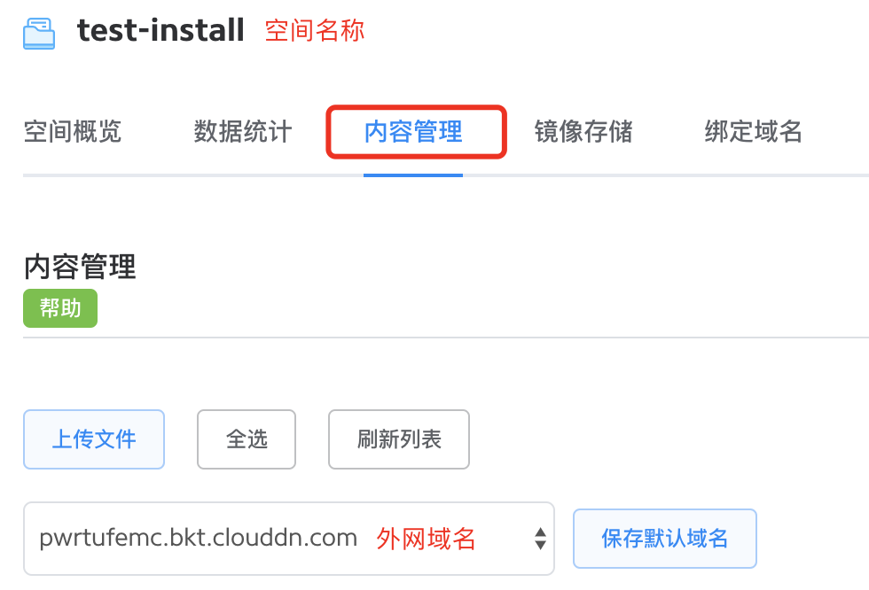
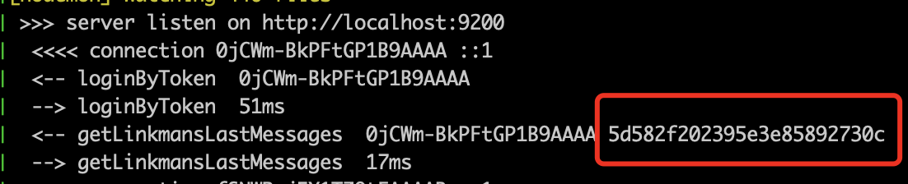

# How to run


## Environmental Preparation
To run Fiora, you need Node.js (v10 LTS version, eg 10.6.3) development environment and MongoDB database
- Install Node.js
   - Official website <https://nodejs.org/en/download/>
   - It is recommended to use nvm to install Node.js
      - Install nvm <https://github.com/nvm-sh/nvm#install--update-script>
      - Install Node.js via nvm <https://github.com/nvm-sh/nvm#usage>
- Install MongoDB
   - Official website <https://docs.mongodb.com/manual/installation/#install-mongodb>

Recommended for running on Linux and MacOS systems

## How to run

<a id="running-on-the-local" style="color: unset; text-decoration: none;">
   <h3>Running on the local</h3>
</a>

1. Clone the project to the local `git clone https://github.com/yinxin630/fiora.git -b master`
2. Installation project dependencies, strongly recommended to use yarn installation, execute `yarn`. You can also use `npm` to install and execute `npm i`
3. Modify the configuration as needed. It is also possible to use the default configuration. For details, please refer to [Project Configuration](#project-configuration)
4. Start the server `npm run server`
5. Start the client `npm run client`
6. Use a browser to open `http://localhost:8080`

*Modify the code will automatically restart the server and refresh the client*

### Running on the server

1. Reference [Running on the local Step 1](#running-on-the-local)
2. Reference [Running on the local Step 2](#running-on-the-local)
3. Reference [Running on the local Step 3](#running-on-the-local)
4. Build a static client `npm run build`
5. Move the client build artifact to the server static resource directory `npm run move-dist`
6. Start the server `npm start`
7. Use a browser to open `http://[server ip]:[fiora port number]`

When deploying on the server, it is strongly recommended to configure the 七牛 CDN. For details, please refer to [七牛 CDN Configuration](#qiniu-cdn-configuration)

### Running on the docker
First install docker <https://docs.docker.com/install/>

#### Run directly from the DockerHub image
1. Pull the mongo image `docker pull mongo`
2. Pull the fiora image `docker pull suisuijiang/fiora`
3. Create a virtual network `docker network create fiora-network`
4. Start the database `docker run --name fioradb -p 27017:27017 --network fiora-network mongo`
5. Start fiora `docker run --name fiora -p 9200:9200 --network fiora-network -e Database=mongodb://fioradb:27017 suisuijiang/fiora`

#### Local build image and run
1. Clone the project to the local `git clone https://github.com/yinxin630/fiora.git -b master`
2. Build the image `docker-compose build --no-cache --force-rm`
3. Run it `docker-compose up`


<a id="project-configuration" style="color: unset; text-decoration: none;">
   <h2>Project Configuration</h2>
</a>
Configuration list
- Server configuration `config/server.ts`
- Client configuration `config/client.ts`
- Client build configuration `config/webpack.ts`

### Modifying the configuration through the configuration file
You can edit the configuration file directly and modify the corresponding configuration values.   
*Because the contents of the file have been modified, subsequent new code may cause conflicts*

### Modify configuration by command arguments
- Direct runtime `./node_modules/.bin/ts-node server/main.ts --xxx "yyy"`
- Run through npm `npm start -- --xxx "yyy"`
- Run through pm2 `pm2 start npm -- start --xxx "yyy"`

`xxx` is the configuration name, `yyy` is the value to be configured, and the configuration name can be viewed in the configuration file.
*Recommended to modify the configuration using this method*

### Modify configuration by environment variable
- Linux and MaxOS systems `export XXX="yyy" && ./node_modules/.bin/ts-node server/main.ts`
- Windows system `SET "xxx=yyy" && ./node_modules/.bin/ts-node server/main.ts`


<a id="qiniu-cdn-configuration" style="color: unset; text-decoration: none;">
   <h2>七牛 CDN configuration</h2>
</a>
In the case where the 七牛 CDN is not configured, the client resources and the user upload/download images are all cost server bandwidth, and the concurrent bandwidth is large, and the server is easy to crash, so it is strongly recommended to use the 七牛 CDN.

Other CDN operators did not support, welcome PR

1. Register the 七牛 account and create a storage space <https://developer.qiniu.com/kodo/manual/1233/console-quickstart#step1>
2. Get the space name and extranet url
   
3. Get the key, mouse to the top right corner of the avatar, click "Key Management", get AccessKey and SecretKey
   

### Build client upload to 七牛
1. Download and install the 七牛 Command Line tool <https://developer.qiniu.com/kodo/tools/1302/qshell>, rename it to `qshell` and add it to the environment variable.
2. Log in to the 七牛 `qshell account AccessKey SecretKey name`
3. Create a `.qiniurc` configuration file in the fiora directory, as follows:
```json
{
     "src_dir" : "./dist",
     "bucket" : "七牛 bucket name",
     "overwrite": true,
     "rescan_local": true
}
```
4. Build the client, pass the 七牛 public url as publicPath `npm run build -- --publicPath "http://example address/fiora/"
5. Upload the build structure to the CDN `qshell qupload .qiniurc`
6. Update the client index.html `npm run move-dist`, if it is a local build upload CDN, please manually update index.html to the server under the fiora public directory

* Repeat 4~6 steps after each update of the client code*

### Update server 七牛 configuration
1. Modify the configuration items in `config/server.ts`: `qiniuAccessKey` / `qiniuSecretKey` / `qiniuBucket` / `qiniuUrlPrefix`
    *Note that the qiniuUrlPrefix configuration value should be slashed/terminated, for example: `http://example address/fiora/`*
2. Modify the configuration item in `config/webpack.ts`: `build.assetsPublicPath`, which is the same as the `publicPath` value when building the client.
3. Restart the server


## pm2 Remote Deployment / Update
1. Install pm2 `yarn global add pm2` on the server and client respectively.
2. Create a directory to store the project on the server, for example `mkdir -p ~/fiora`
3. Pull the project to the source folder under the directory `git clone -b master git@github.com:yinxin630/fiora.git ~/fiora/source`
4. Create the pm2 ecosystem configuration file `cp ecosystem.config.js.example ecosystem.config.js`
5. Modify the contents of the configuration file
6. Deploy or update `./deploy.sh` for the first time.

For details, please refer to <http://pm2.keymetrics.io/docs/usage/deployment/>


## Third-party installation tutorial
<https://www.moerats.com/archives/978/>


## FAQ
### How to set up an administrator
1. Get the user id, note that it is not username, is the _id in the mongoDB database
   - Can query the database to get
   - You can also see the server interface log acquisition. The interface that needs to be logged in will print the user id.
      
2. Modify the `administrator` field in `config/server.ts` to change the id obtained in the previous step.
3. Restart the server

### Modify the default group name
1. Modify the `defaultGroupName` field in `config/server.ts`
2. Restart the server