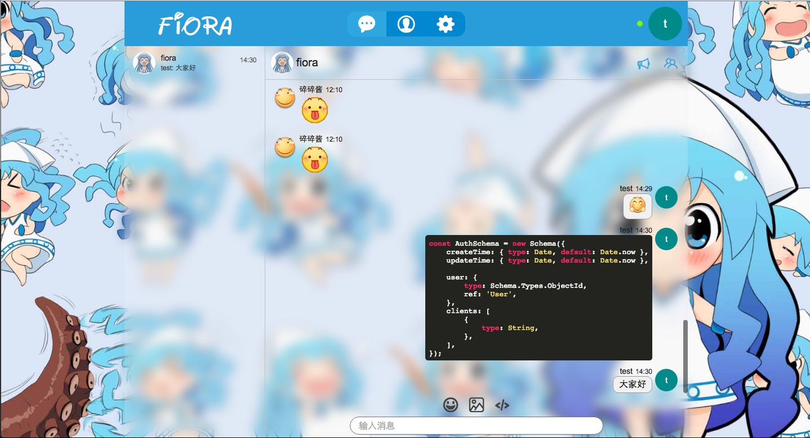

# Fiora

Fiora is a web chat application. Made by node.js, koa, react.

[中文版](readme-zh.md)

## Function

0. Register user, create group, join group, private chat, group chat
0. Support text, image, code, url types of message
0. Desktop notification, sound notification, notification switch
0. Customize avatar, collect expression, customize group announcement
0. Limit message length, message frequency
0. A simple plugin system

## Run Shot

## Installation

The project is powered by node.js and mongodb database. To install [node.js](https://nodejs.org/en/download/) ([For China mirror](https://npm.taobao.org/mirrors/node)). To install [mongodb](https://docs.mongodb.com/manual/installation/).

0. Clone this repository  
`git clone git@github.com:yinxin630/fiora.git`
0. Go to repository directory and run  
`npm install`
0. Create config file from simple config. The `localServer`, `localPort`, `database`, `jwtSecret` is necessary.  
`cp config/config.simple.js config/config.js`. 
0. Set database and other params in config file
0. Run the project  
`npm start`
0. Open `http://localhost:8080/webpack-dev-server/` and enjoy it

## Contribute

If you want to add functionality or fix bug, please observe the following process.

0. Fork this repository and clone the fork
0. Install dependencies `npm install`
0. Modify the code and check for bug
0. Commit your code. If you get any error or warning from eslint, please fix it
0. Create a pull request 

## Roadmap

### v1.1

* Mobile web support
* ~~Self message instead to add it when before send~~
* ~~Use chinese to format time~~

### v1.2

* Theme mechanism
* Message encrypt mechanism
* Nav bar optimize
* Save user setting on server
